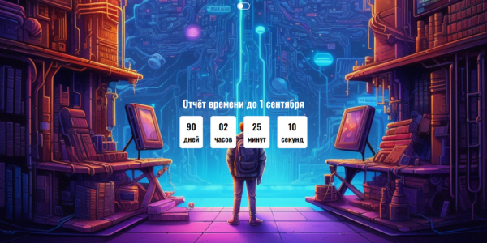
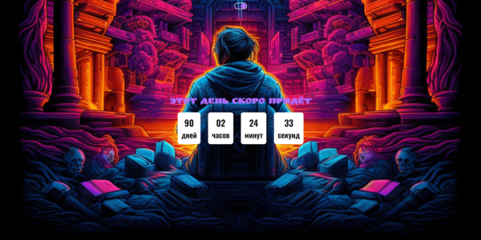

# Таймер - отчёт времени 

Данный проект создавался для того чтоб мелкий видел сколько времени у него осталось до начала учебного года. А также небольшой интерактив для более интересного использования.

__В даном проекте__
1. таймер установлен до 2023-09-01
2. два вида изображения который переключаются
3. при переключениях меняется надпись над таймером
4. изображения сгенерированные ( вдохновлялся иллюстратором художником __Dan Mumford__)

[Ссылка на проект](https://rudkevich.github.io/Timer/)
***

***

